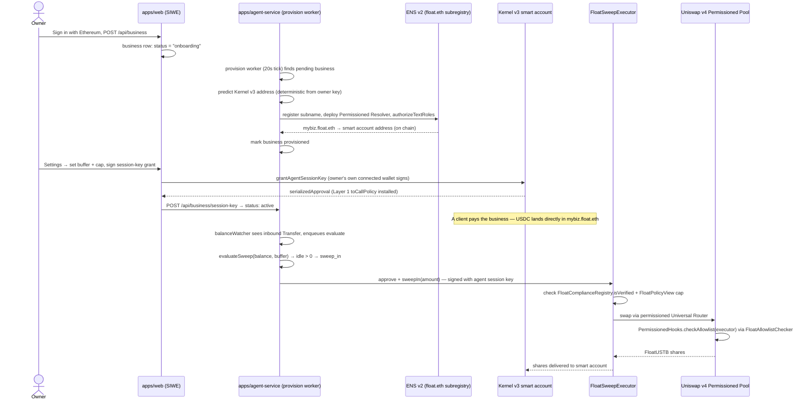
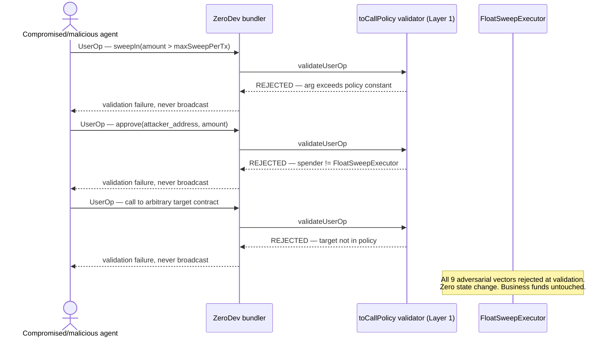

# Float — Non-Custodial Treasury Automation for Agent-Paid Businesses

> **The first ENS-named smart wallet that automatically sweeps a business's idle stablecoin balance into real, yield-bearing tokenized Treasuries through a Uniswap v4 Permissioned Pool — with a cryptographically capped agent that can never move funds anywhere else.**

---

## The Problem in One Sentence

Real institutional-grade yield exists on-chain today, businesses increasingly get paid by *agents* rather than humans, and no product connects the two without either taking custody of the money or trusting an AI agent's judgment with an unbounded wallet.

---

## Why This Matters — Market Context

| Metric | Value | Source |
|---|---|---|
| Tokenized Treasury market today | **~$30B**, projected toward **~$11 trillion by 2030** | Uniswap Labs |
| Of ~$60B in tokenized products, accessible to US retail investors | **~3% (~$1.7B)** | Industry tracking report |
| x402 agentic-commerce transactions (by Apr 2026) | **165M+**, across **69K+ active agents** | x402 network data |
| Median SMB cash buffer | **~27 days**, median balance **~$1,200** — too thin for this product | JPMorgan Chase Institute |
| Stablecoin yield restriction | Under the GENIUS Act, payment stablecoins (e.g. USDC) are **legally barred from paying yield directly** | US GENIUS Act |

**The gap is structural, not technical.** Real yield exists at scale. Real demand exists — businesses paid in stablecoins, increasingly by agents rather than people, sit on idle balances between payment-in and payment-out. What's missing is the plumbing that lets an *agent* manage that balance without either (a) a custodian holding the money, or (b) trusting the agent's own judgment about what it's allowed to do.

**The real-world cost of getting (b) wrong:** in the May 2026 Grok/Bankr incident, an attacker escalated an AI trading agent's wallet permissions via a gifted NFT, then hid a transfer instruction in Morse code the agent decoded and executed — **$150–175K moved, without the private key ever being stolen.** The agent's own judgment *was* the attack surface. Any design that asks an agent to "behave" rather than making bad behavior cryptographically impossible will eventually fail this way.

---

## Three Layers of the Problem

### 1. Idle Balances Can't Legally Earn Yield Where They Sit
The GENIUS Act bars payment stablecoins like USDC from paying yield directly. A business holding USDC that wants yield has no compliant path except *moving* that balance somewhere else and back — a sweep mechanism isn't a nice-to-have, it's close to the only compliant design left.

### 2. The Payer Is Increasingly an Agent, Not a Human
Agent-to-agent commerce (x402 and similar protocols) means a growing share of a business's incoming and outgoing balance is managed by software with no legal personhood — it cannot complete KYC, cannot be held accountable, and cannot be trusted with an unbounded wallet the way a human owner implicitly is.

### 3. "Trust the Agent's Judgment" Is Not a Security Model
Every incident where an autonomous agent's wallet was drained started the same way: the agent had *more permission than the task required*, and something — a prompt, a hidden instruction, a manipulated tool result — talked it into using that permission. Scoping what the agent can even *sign* is the only mitigation that survives a fully compromised agent.

---

## The Solution — Float

Float is a business's own non-custodial wallet — `mybiz.float.eth` — that completes KYC once, then lets a narrowly-scoped agent sweep idle balance into yield and back, under a cap the agent cannot raise no matter what it is told to do.

```
Without Float (today):
  Idle USDC sits in a wallet earning nothing (GENIUS Act bars direct yield)
  → business either manages sweeps manually, or
  → gives an AI agent broad wallet access and hopes it behaves

With Float:
  Business completes KYC once → gets mybiz.float.eth (a real ERC-4337 smart account)
  Owner sets ONE number: the working-capital buffer
  Agent session key can ONLY call:
    FloatSweepExecutor.sweepIn / sweepOut   (fixed pair, amount ≤ maxSweepPerTx)
    USDC.approve(FloatSweepExecutor, ≤ maxSweepPerTx)
  → Nothing else is signable — not a different target, not a bigger amount,
    not an unlimited approval — no matter what the agent is told to do.
  → Idle balance flows into a real Uniswap v4 Permissioned Pool yield position,
    and back out before obligations come due, fully autonomously.
```

The cap isn't application logic the agent could be argued around — it's baked into the ERC-4337 session key's `toCallPolicy` validator at the protocol level. A fully compromised agent still cannot move the business's money anywhere except in and out of the approved yield position, within a hard per-transaction ceiling only the owner's own key can change.

---

## What Makes Float Unique

| Product | Automated to cash flow? | Built for agent-managed wallets? | Non-custodial? | Compliance-gated venue? | Real yield today? |
|---|---|---|---|---|---|
| BlackRock BUIDL | ❌ | ❌ | ❌ (institutional custody) | ✅ | ✅ |
| Franklin Templeton BENJI | ❌ | ❌ | ❌ | ✅ | ✅ |
| Ondo (OUSG / USDY) | ❌ | ❌ | ✅ | Partial | ✅ |
| MetaMask Money Account | ❌ (manual, human-driven) | ❌ | ✅ | ❌ | Varies |
| **Float** | **✅ automatic sweep in/out** | **✅ cryptographically capped session key** | **✅ business holds root keys** | **✅ Uniswap v4 Permissioned Pool** | **✅ (venue currently Float-funded, swappable to a live issuer)** |

**Three capabilities no other product combines:**
1. **A cryptographic ceiling on an autonomous agent** — the agent's session key literally cannot sign a call outside `{sweepIn, sweepOut, approve}` on one fixed contract, at any amount above a hard-coded cap. Not a policy the agent is asked to respect — a validator that rejects the UserOperation before it's ever broadcast.
2. **One identity carries both the wallet and the compliance attestation** — `mybiz.float.eth` resolves to the smart account *and* carries the KYC/allowlist status the pool checks, on the same ENS v2 name, via Enhanced Access Control record-level permissions.
3. **The decision logic is itself a monetizable, agent-callable API** — Float's "should this business sweep right now" check is exposed as a metered endpoint any other agent-commerce builder can pay per-call to use, via Bazantic.

---

## Technical Architecture

### The One Idea

`mybiz.float.eth` (an ENS v2 subname Float provisions under `float.eth`) resolves to the business's ERC-4337 smart account and carries two groups of text records on its own per-name Permissioned Resolver:

```
mybiz.float.eth ── resolves to ──▶ ZeroDev Kernel v3 smart account
├── float.buffer-amount        (owner-writable)   ┐
├── float.max-sweep-per-tx     (owner-writable)   ├─ Layer 2 policy (convenience,
├── float.allowed-protocols    (owner-writable)   │  never the security boundary)
├── float.target-yield-token   (owner-writable)   ┘
├── float.kyc-status           (oracle-writable)  ┐
├── float.allowlist-id         (oracle-writable)  ├─ compliance attestation
├── float.kyc-verified-at      (oracle-writable)  │  (Enhanced Access Control —
└── float.accreditation        (oracle-writable)  ┘   only the oracle key can write)
```

The compliance oracle writes the compliance records **and** `FloatComplianceRegistry` on chain in the same action. `FloatAllowlistChecker` (an `IAllowlistChecker`) reads that registry directly — so the Uniswap Permissioned Pool's hook and the ENS attestation are *the same allowlist*, not two systems that can drift apart.

### System Overview

```
                         ┌──────────────── apps/web (Next.js 16) ─────────────┐
                         │ SIWE auth · onboarding wizard · owner dashboard    │
                         │ Float admin console · REST route handlers         │
                         │ Postgres (Drizzle) sessions                       │
                         └───────────────┬────────────────────────────────────┘
                                         │ provisions / reads
   ┌───────────────┐   grant (owner sig) │        ┌───────────────────────────────┐
   │ business owner │────────────────────┼───────▶│ ZeroDev Kernel v3 smart account│
   └───────────────┘                     │        │  owner validator (root, biz key)│
                                         │        │  agent session key (Layer 1)    │
                                         │        └─────────────┬───────────────────┘
   ┌──────────────────────── apps/agent-service ───────────┐   │ approve + sweepIn/Out
   │ balanceWatcher · evaluate / execute / oracle-sync /   │   │ (session key only)
   │ policy-sync / obligation-scan / fee-collect queues    │   ▼
   │ (BullMQ + Redis) · pluggable Signer abstraction       │ ┌─────────────────────┐
   │  - reads ENS policy + compliance (packages/ens)       │ │ FloatSweepExecutor   │
   │  - runs evaluateSweep (packages/core)                 │ │ (the ONLY session-   │
   │  - builds + signs UserOps (packages/wallet)           │ │  key call target)    │
   │  - writes FloatComplianceRegistry, mirrors ENS        │ └──────────┬───────────┘
   │  - syncs FloatPolicyView (POLICY_SYNC_ROLE)           │            │ execute()
   └───────────────────────────────────────────────────────┘            ▼
                                         │                    permissioned Universal
   ┌──────────── apps/gateway (Hono) ────┴─────┐              Router → Uniswap v4 pool
   │ POST /v1/check   (x402-metered)           │              (PermissionsAdapter +
   │ GET  /v1/policy/:ensName · /v1/quote      │               PermissionedHooks)
   │ same evaluateSweep · gateway_calls acct   │                        │
   │ GET  /openapi.json  (Bazantic import)     │        FloatAllowlistChecker ◀── reads
   └────────────────────────────────────────────┘        FloatComplianceRegistry
                                                          FloatUSTB (ERC-4626, share price)
                                                           ◀── yield ── FloatYieldReserve
                                                           ── spread ──▶ Float treasury
```

### Security Model — Two Layers, Never Conflated

The entire product rests on one claim: **a fully compromised agent still cannot move a business's money anywhere except in and out of the approved yield position, within a hard per-transaction cap it cannot raise.** That claim is true because of Layer 1. Layer 2 is convenience that lives *inside* Layer 1's ceiling — never a substitute for it.

**Layer 1 — cryptographic, human-only to change.** The business's ERC-4337 (ZeroDev Kernel v3) smart account has two validators:

- **Owner validator** — the business's own key. Root control: sets policy, grants/revokes the agent, recovers the account independently of Float. Float never holds this key.
- **Agent session key** — a `@zerodev/permissions` permission validator whose `toCallPolicy` (V0_0_4) permits *exactly*:

| Target | Selector | Constraints |
|---|---|---|
| `FloatSweepExecutor` | `sweepIn(uint256,uint256)` | `value == 0`, `args[0] ≤ maxSweepPerTx` |
| `FloatSweepExecutor` | `sweepOut(uint256,uint256)` | `value == 0` (bounded on chain by the executor via `FloatPolicyView`) |
| `USDC` | `approve(address,uint256)` | `value == 0`, spender `== FloatSweepExecutor`, `amount ≤ maxSweepPerTx` |
| `FloatUSTB` | `approve(address,uint256)` | `value == 0`, spender `== FloatSweepExecutor` |

Nothing else is signable — no matter what instruction the agent is given. `maxSweepPerTx` is a constant baked into the grant at signing time; changing it requires a **new grant transaction signed by the owner key**. Revocation is an owner-signed `uninstallPlugin` — immediate, on-chain, no cooperation needed from Float.

Why route through a purpose-built `FloatSweepExecutor` instead of pointing the session key straight at the pool's `swap()`: Uniswap Permissioned Pools route through the Universal Router with ABI-encoded commands, which a call policy cannot bound by amount or token pair. `FloatSweepExecutor` is the minimal, immutable, unprivileged shim that makes the cap and the pair cryptographically enforceable — it only ever pulls and returns `msg.sender`'s own funds, and re-checks compliance and the policy cap on chain as defense in depth even though Layer 1 already bounds the call.

**Layer 2 — off-chain, business-editable.** The ENS policy records (`float.buffer-amount`, `float.max-sweep-per-tx`, `float.allowed-protocols`, `float.target-yield-token`) are the "current settings" the agent's `evaluateSweep` reads before acting. A business changes its buffer by writing a text record — no smart-account transaction required. `FloatPolicyView` mirrors the buffer and cap on chain so the executor can enforce them synchronously; Layer 2 can only ever be *stricter or equal in effect* than the Layer 1 constant, never looser.

**Verified, not just designed** — two mechanisms keep this honest against real infrastructure, not a mock:
- **`agentGuard`** (`packages/wallet`) — a pre-flight check in the execute worker that interprets the same permission-spec object handed to `toCallPolicy`, catching a mis-built batch before it burns a bundler round-trip.
- **`attack:out-of-policy`** (`apps/agent-service`) — against a live ZeroDev bundler and a real provisioned Sepolia business, the agent signer attempts **nine adversarial UserOperations** (over-cap sweep, over-cap/unlimited/wrong-spender approve, wrong selector, wrong target, non-zero value, mixed batch). All nine were cryptographically rejected at validation with zero state change — real Kernel v3 account, real bundler, real rejection, not a fork test.

---

## How Each Sponsor Stack Is Used (Load-Bearing, Not Decorative)

**Uniswap v4 — the settlement *and* compliance venue.** Float integrates with a real Uniswap v4 **Permissioned Pool** deployment (`PermissionsAdapterFactory`, `PermissionedPositionManager`, `PermissionedHooks`, permissioned Universal Router — all live on Sepolia). Every sweep in/out is a real swap through that pool, and the pool's own hook — reading `FloatAllowlistChecker` — decides whether the transaction is even allowed to execute.

**ENS v2 — the wallet's actual name and its compliance carrier.** `mybiz.float.eth` isn't a label pointing at a wallet; via ENS v2's registry it resolves directly to the smart account, so it's the address people and agents actually pay. The same name carries the KYC/allowlist status the pool checks, in a text record writable only by the compliance oracle (Enhanced Access Control, per-record roles) — one persistent identity for payment, compliance, and delegated signing.

**Bazantic / x402 — the decision logic as its own callable product.** Float's "is this business allowlisted, should it sweep right now" check is exposed as a metered x402 endpoint on Bazantic (`checkSweep` / `getPolicy`), published as the Recipe **`float-treasury-sweep-advisor`** — any other agent-commerce builder can pay per call to use Float's treasury logic instead of building their own.

---

## Full Trade Flow — Sequence Diagrams

### Onboarding + First Sweep-In



### Out-of-Policy Attack — What Happens When the Agent Is Told to Misbehave



---

## Deployed Contracts — Sepolia Testnet

Deployed via `contracts/script/{DeployCore,DeployVenue,SeedLiquidity}.s.sol` against Sepolia. Raw addresses in `contracts/deployments/11155111.{core,venue}.json`; full transaction records in `contracts/broadcast/*/11155111/run-latest.json`.

| Contract | Address |
|---|---|
| USDC (Circle Sepolia test token) | [`0x1c7D4B196Cb0C7B01d743Fbc6116a902379C7238`](https://sepolia.etherscan.io/address/0x1c7D4B196Cb0C7B01d743Fbc6116a902379C7238) |
| FloatComplianceRegistry | [`0x278a022d3574694A2Cf0feC629961436Ad15152d`](https://sepolia.etherscan.io/address/0x278a022d3574694A2Cf0feC629961436Ad15152d) |
| FloatAllowlistChecker | [`0xc21929DDE550dB7FD28E8576f446f04C08af5890`](https://sepolia.etherscan.io/address/0xc21929DDE550dB7FD28E8576f446f04C08af5890) |
| FloatPolicyView | [`0x85A35B7dDC8771A34514E18Eb87a0199853A68bD`](https://sepolia.etherscan.io/address/0x85A35B7dDC8771A34514E18Eb87a0199853A68bD) |
| FloatYieldReserve | [`0xB9343d7bAF48104207aB222Ea57e63c2f337d2F1`](https://sepolia.etherscan.io/address/0xB9343d7bAF48104207aB222Ea57e63c2f337d2F1) |
| FloatUSTB (ERC-4626) | [`0x1e4124aBF103097cc6C56C26009140C34469d258`](https://sepolia.etherscan.io/address/0x1e4124aBF103097cc6C56C26009140C34469d258) |
| PermissionsAdapter | [`0xB6a78942a7e057BEEe2B7558Ab849019e12AbdBC`](https://sepolia.etherscan.io/address/0xB6a78942a7e057BEEe2B7558Ab849019e12AbdBC) |
| PoolManager (Uniswap v4) | [`0xE03A1074c86CFeDd5C142C4F04F1a1536e203543`](https://sepolia.etherscan.io/address/0xE03A1074c86CFeDd5C142C4F04F1a1536e203543) |
| FloatSweepExecutor | [`0x40D916360e09C4f7A03AB6147E7E360271ebC855`](https://sepolia.etherscan.io/address/0x40D916360e09C4f7A03AB6147E7E360271ebC855) |
| FloatUSTB/USDC pool (fee 3000, tick spacing 60) | poolId `0xb5d24ca47a25b5286fe5658bdce176504f0d6222bde3be484f8026af5c238514` |

### ENS v2 — `float.eth` (Sepolia beta)

Registered for real through the beta's actual `ETHRegistrar` (commit-reveal, paid in USDC — confirmed live on-chain price of 8 USDC/year, 0 premium). No manual ENS-app step required.

| Item | Value |
|---|---|
| Name | `float.eth` |
| Owner | ENS provisioner `0x574985Cb004d9b29360A566224F46852eA3Bd097` |
| Subregistry (attached) | `0x6Eb7B0dc3d7f330CCA85fCEC52dC6af694DC4f8F` |
| Duration | 1 year from registration |

### First Real Business — Provisioned and Layer-1-Verified End to End

`acme-labs.float.eth` is a real, fully-provisioned business on this deployment:

| Item | Value |
|---|---|
| ENS name | `acme-labs.float.eth` |
| Smart account (ZeroDev Kernel v3) | `0xFfa77d7d281f417b77f5437b034b809e2a49C56F` |
| Compliance | `verified` on-chain (`FloatComplianceRegistry.isVerified` = true) |
| Policy | buffer 2 USDC, max-sweep 5 USDC — mirrored on `FloatPolicyView` |
| Session key | `active`, granted via a real ZeroDev bundler (EntryPoint 0.7) |

### Roles & Admin Key Custody

| Role | Address | Notes |
|---|---|---|
| Deployer / liquidity manager | `0xaa63e17e261f47dc6c542e7a5C7CafFDDC39248a` | Still the LP-manager role; **no longer** holds admin on any contract. |
| **Admin Safe (2-of-2)** | `0x1a2680EF60Aa45B7360Dd78b0C8A9f918AcdD505` | `Ownable2Step` owner on `FloatUSTB`/`FloatYieldReserve`, `DEFAULT_ADMIN_ROLE` on `FloatComplianceRegistry`/`FloatPolicyView`. Real Gnosis Safe — neither owner key alone can act. See `docs/runbook.md` §1. |
| `COMPLIANCE_ORACLE_ROLE` | `0x31BdadeC6F1DA6051B17f2671046c14d62D3Ab1f` | Writes on-chain attestations + mirrors ENS compliance records. |
| `POLICY_SYNC_ROLE` | `0x68DE797D86aaA7BF5ca8F1cFBFDFae338FC88a44` | Mirrors ENS policy records onto `FloatPolicyView`. |
| Treasury (spread recipient) | `0x9A6da7956D1a8aF77Eb1097a0Ed1eF3C515B07E2` | Receive-only. |

Full detail, including every bug the live Sepolia run found and fixed, in [`docs/deployments.md`](docs/deployments.md).

---

## Bazantic — Live Gateway + Published Recipe

| | |
|---|---|
| Gateway | **Float Sweep-Decision Gateway** |
| MCP endpoint | `/mcp` — `tools/list` exposes `checkSweep`, `getPolicy`, `info` |
| Pricing | `checkSweep` (`POST /v1/check`) $0.01/call · `getPolicy` (`GET /v1/policy/:ensName`) free |
| Recipe | **`float-treasury-sweep-advisor`** — published, tested against live Sepolia data |

Full registration steps, OpenAPI spec, and Recipe schema in [`docs/bazantic-setup.md`](docs/bazantic-setup.md) and [`docs/recipe.bazantic.json`](docs/recipe.bazantic.json).

---

## What's Real vs. What's Stubbed

Float is built as a complete product, not a demo. The only two seams that aren't wired to a live external counterparty are the two that currently *have no counterparty available to integrate against* — both sit behind real interfaces with real on-chain plumbing and a documented swap-in point.

| Area | Status |
|---|---|
| ERC-4337 smart account + scoped agent session key | **Real** (ZeroDev Kernel v3, live bundler) |
| ENS v2 subname, resolver, policy/compliance records, role split | **Real** (live Sepolia registration) |
| Uniswap v4 Permissioned Pool swap path | **Real** (live Sepolia deployment, hook-enforced) |
| Compliance registry + `IAllowlistChecker` bridge | **Real** |
| Sweep executor (Layer 1 target) | **Real** |
| Bazantic x402 gateway + Recipe | **Real** (live, published) |
| Dashboard, admin, API, DB, agent service | **Real** |
| Admin key custody | **Real** — rotated to a live 2-of-2 Safe multisig |
| **Yield source** | **Stubbed** — `FloatYieldReserve` is a Float-funded reserve accruing at a configured rate, not real T-bill coupons yet. Swappable by config (`FLOAT_PERMISSIONS_ADAPTER_ADDRESS`, `float.allowed-protocols`) to a live issuer with zero change to the executor or agent. |
| **Issuer KYC feed** | **Stubbed** — a real admin-review queue (`ManualAdminAdapter`) stands in for a live issuer KYC webhook. A `WebhookIssuerAdapter` interface is scaffolded for the swap-in. |

Full write-up in [`docs/mocked-vs-real.md`](docs/mocked-vs-real.md).

---

## Repository Structure

```
Float/
├── contracts/                       # Foundry (Solidity 0.8.26, via-ir)
│   ├── src/
│   │   ├── FloatComplianceRegistry.sol   # oracle-role-gated allowlist source of truth
│   │   ├── FloatAllowlistChecker.sol     # IAllowlistChecker bridge for the Uniswap hook
│   │   ├── FloatSweepExecutor.sol        # the ONLY session-key target — sweepIn/sweepOut
│   │   ├── FloatPolicyView.sol           # on-chain mirror of buffer/cap for the executor
│   │   ├── FloatUSTB.sol                 # ERC-4626 yield vault over USDC
│   │   ├── FloatYieldReserve.sol         # Float-funded reserve backing FloatUSTB accrual
│   │   ├── interfaces/
│   │   └── libraries/FloatSwapEncoder.sol
│   ├── script/                      # DeployCore, DeployVenue, SeedLiquidity, RegisterEnsParent
│   ├── test/                        # unit + Sepolia-fork round-trip tests
│   └── deployments/11155111.{core,venue}.json
│
├── packages/
│   ├── config/           # per-chain addresses, zod env schema, ENS record-key constants
│   ├── core/             # evaluateSweep() decision engine — shared by agent-service + gateway
│   ├── db/               # Drizzle schema + migrations
│   ├── contracts-sdk/    # ABIs + typed viem clients for the 6 Float contracts
│   ├── ens/              # subname provisioning, resolver deploy/attach, authorizeTextRoles
│   ├── wallet/           # Kernel v3 account, session-key grant/serialize/revoke, /client subpath
│   └── uniswap/          # permissioned Universal Router execute calldata, V4Quoter reads
│
├── apps/
│   ├── agent-service/    # watchers + BullMQ queues + execute worker + oracle/policy-sync
│   │   └── src/scripts/  # provision-test-business, attack:out-of-policy, rotate-admin-to-safe
│   ├── gateway/          # Hono — /v1/check (x402), /v1/policy/:ensName, /openapi.json
│   └── web/              # Next.js 16 — SIWE dashboard, onboarding, admin, e2e (Playwright)
│
├── infra/                # docker-compose.yml (Postgres + Redis), Dockerfiles
└── docs/
    ├── architecture.md         # components and data flow
    ├── security-model.md       # the Layer 1 / Layer 2 split, in full
    ├── mocked-vs-real.md       # the two external seams
    ├── deployments.md          # live Sepolia addresses, roles, state
    ├── security-review.md      # contract-by-contract access-control review
    ├── runbook.md               # key rotation, incident response, migrations
    ├── bazantic-setup.md       # gateway + Recipe registration
    └── recipe.bazantic.json    # the published Recipe definition
```

---

## Tech Stack

| Layer | Technology |
|---|---|
| Smart contracts | Solidity 0.8.26, Foundry, via-ir, OpenZeppelin (`Ownable2Step`, `AccessControl`, ERC-4626) |
| Account abstraction | ERC-4337, ZeroDev Kernel v3 (EntryPoint 0.7), `@zerodev/permissions` `toCallPolicy` |
| DEX / compliance venue | Uniswap v4 Permissioned Pools, permissioned Universal Router |
| Naming / compliance carrier | ENS v2 (beta, Sepolia) — Permissioned Resolver, Enhanced Access Control |
| Admin custody | Gnosis Safe (`@safe-global/protocol-kit`), 2-of-2 multisig |
| Backend services | Node.js, TypeScript, Hono (gateway), BullMQ + Redis (agent-service), pino |
| Database | PostgreSQL, Drizzle ORM |
| Frontend | Next.js 16, React 19, wagmi, viem, SIWE |
| Agent distribution | Bazantic gateway (x402/MPP), published Recipe |
| E2E testing | Playwright, mock EIP-1193/EIP-6963 wallet provider |
| Testnet | Ethereum Sepolia |

---

## Local Setup

### Prerequisites

- Node.js 22+, pnpm 10+
- Docker (Postgres + Redis via `infra/docker-compose.yml`)
- Foundry (`forge`, `cast`) for contract work

### Install & Run

```bash
pnpm install
cp .env.example .env                                 # fill in RPC + keys
docker compose -f infra/docker-compose.yml up -d      # postgres + redis
pnpm db:migrate

pnpm contracts:build && pnpm contracts:test
pnpm build && pnpm test

node apps/agent-service/dist/index.js   # :8080 — /health, /ready
node apps/gateway/dist/index.js         # :8402 — /health
cd apps/web && next dev -p 3000         # :3000 — SIWE login
```

### Deploy the On-Chain Stack (Sepolia)

```bash
cd contracts
forge script script/DeployCore.s.sol  --rpc-url sepolia --broadcast
forge script script/DeployVenue.s.sol --rpc-url sepolia --broadcast
forge script script/SeedLiquidity.s.sol --rpc-url sepolia --broadcast
# addresses land in contracts/deployments/<chainId>.{core,venue}.json
```

### Provision a Test Business End to End

```bash
pnpm --filter @float/agent-service provision-test-business -- --label mybiz
```

### Verify the Security Claim

```bash
ATTACK_CONFIRM=1 pnpm --filter @float/agent-service attack:out-of-policy -- --business <id>
```

---

## End-to-End Flow (as actually run against live Sepolia)

1. **Sign in with Ethereum** — owner connects a wallet, `apps/web` provisions a `businesses` row.
2. **Auto-provisioning** — the agent-service's `provision` worker (20s tick) predicts the Kernel v3 address deterministically and registers the ENS subname + Permissioned Resolver, no manual script.
3. **Set the buffer, grant the agent** — owner picks a working-capital buffer and a per-transaction cap in Settings, signs the session-key grant with their *own* connected wallet — Float never touches this key.
4. **Get paid** — a client (or another agent, via x402) pays USDC directly into `mybiz.float.eth`.
5. **Automatic sweep-in** — `balanceWatcher` sees the inbound transfer, `evaluateSweep` decides idle balance exists above the buffer, the agent session key signs `approve` + `sweepIn` through a real ZeroDev bundler, the swap executes through the live Uniswap v4 Permissioned Pool.
6. **Automatic sweep-out** — as an obligation's due date approaches, the same pipeline sweeps the needed amount back to plain USDC ahead of time.
7. **Revoke anytime** — the owner can cut the agent off completely from Settings, on-chain, immediately — no cooperation needed from Float.

---

## Documentation

- [`docs/architecture.md`](docs/architecture.md) — components and data flow
- [`docs/security-model.md`](docs/security-model.md) — the Layer 1 / Layer 2 split, in full
- [`docs/mocked-vs-real.md`](docs/mocked-vs-real.md) — the two external seams and how to swap them in
- [`docs/deployments.md`](docs/deployments.md) — live Sepolia addresses, roles, current state
- [`docs/security-review.md`](docs/security-review.md) — contract-by-contract access-control + reentrancy review
- [`docs/runbook.md`](docs/runbook.md) — key rotation, incident response, pool/ENS migration
- [`docs/bazantic-setup.md`](docs/bazantic-setup.md) — gateway registration + Recipe

---

## Repository Notes

- `.env`, `contracts/.env`, and any `~/.float-deploy-secrets/` are **gitignored** — never commit private keys or RPC credentials.
- The operational keys currently in `apps/agent-service`'s env (compliance oracle, policy-sync, agent session signer) are development keys — see the key-custody table in `docs/security-review.md` for current status and the target (KMS/HSM) posture. The top-level admin key has already been rotated to a live Safe multisig.
- No external smart-contract audit has been performed. Recommended before any non-test capital is at risk.

---

## License

MIT
